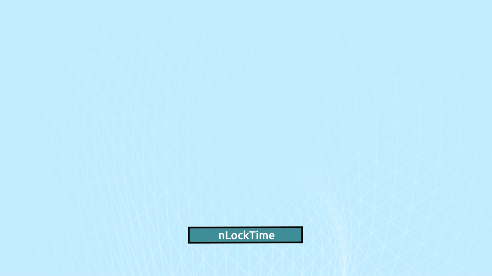
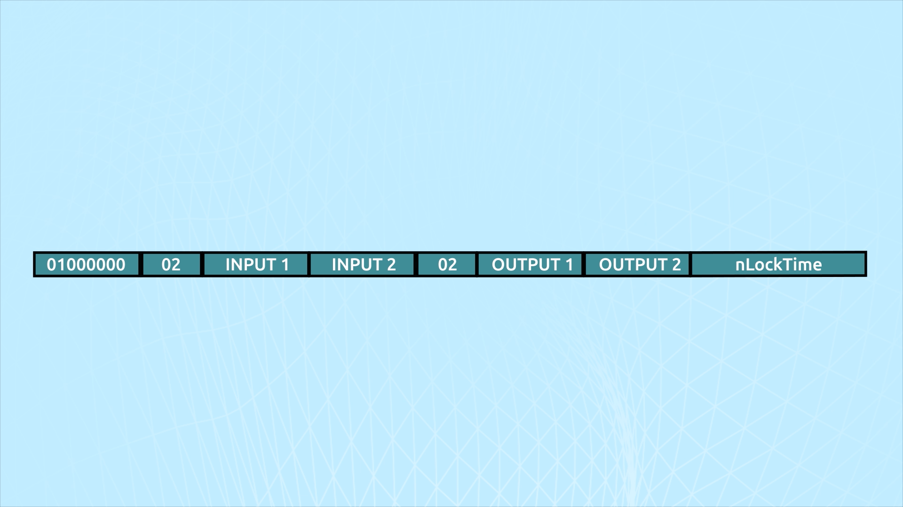

# 06 - nLockTime

`00000000`

The final element of the transaction is its nLockTime. nLockTime is the second part of setting up payment channels.

#### Insert chapter 1 video 3

Payment channels are a highly useful tool and a native element of the Bitcoin protocol.

<figure><figcaption></figcaption></figure>

When a transaction's nLockTime is in the future, it can be considered non-final if there are also inputs with non-final nSequence values. In this particular transaction, the nLocktime is set to 0x00000000 meaning that the field references block 0 and the transaction is final at any time.

<figure><figcaption></figcaption></figure>

In the above animation it can be seen that the transaction is not final until either the nSequence field is UINT\_MAX or the nLockTime passes which then overrides the fact that the nSequence UINT has not been incremented to its MAX value.&#x20;

